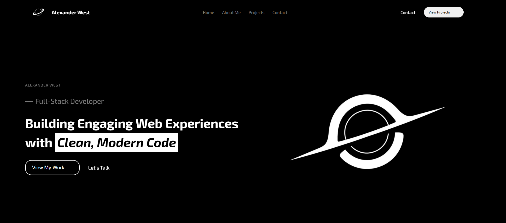

# Alexander West – Portfolio

A modern, responsive portfolio website for Alexander West, full stack engineer. Showcases featured projects, core skills, and technologies with a clean, animated UI.

---

## 🚀 Live Demo

[View the live site](https://your-live-demo-link.com) <!-- Replace with your actual link after deployment -->

---

## ✨ Features
- Animated hero headline with typing effect
- Responsive, mobile-friendly layout
- Project showcase cards
- Skills and technology grid
- Smooth scrolling navigation
- Modern CSS effects (glassmorphism, hover, etc.)
- Easy to customize and extend

---

## 🛠️ Tech Stack
- HTML5 & CSS3
- JavaScript (ES6+)
- [Typed.js](https://github.com/mattboldt/typed.js/) for typing animation
- [AOS](https://michalsnik.github.io/aos/) for scroll animations
- [Boxicons](https://boxicons.com/) for icons

---

## 🏁 Getting Started

1. **Clone the repository:**
   ```sh
   git clone https://github.com/kyprexs/Portfolio.git
   cd Portfolio
   ```
2. **Open `index.html` in your browser**
   - No build step required; all assets are static.
3. **(Optional) Deploy to GitHub Pages, Vercel, or Netlify for a live site.**

---

## 📁 Folder Structure
```
Portfolio/
├── assets/
│   ├── tech/           # Technology SVG icons
│   ├── astronaut-2.jpeg
│   ├── blackhole.png
│   ├── github-analyzer.png
│   ├── roblox-bot.png
│   └── demo.png        # Demo screenshot for README
├── index.html
├── style.css
├── script.js
└── README.md
```
<<<<<<< HEAD

=======
>>>>>>> f02be6ec900875fc66353959e0290ed95fe1f700
---

## 📄 License
This project is open source for learning and personal portfolio use. See the disclaimer below for details.

---

## Disclaimer

This source code is shared **for learning purposes only**. I created it to help beginners explore and experiment with coding techniques, and I'm happy to provide it freely for educational use.

**Please respect the intent of this resource:**
- Do not resell or distribute this code as-is for commercial purposes.
- Before using any part of this code in your own projects, especially commercially, ensure that you've modified it to fit your unique needs and **always check any applicable licensing requirements**.

Thank you for understanding, and happy coding!
